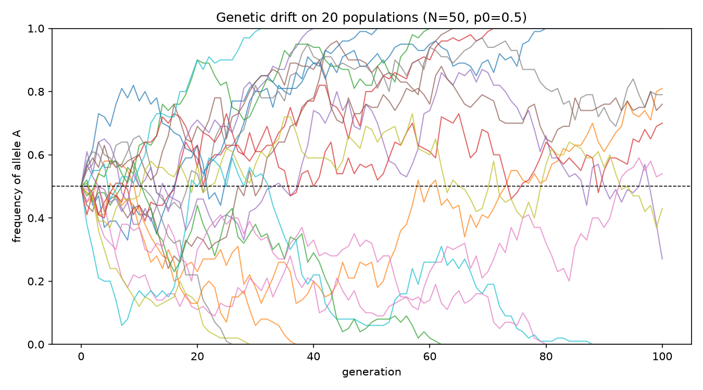
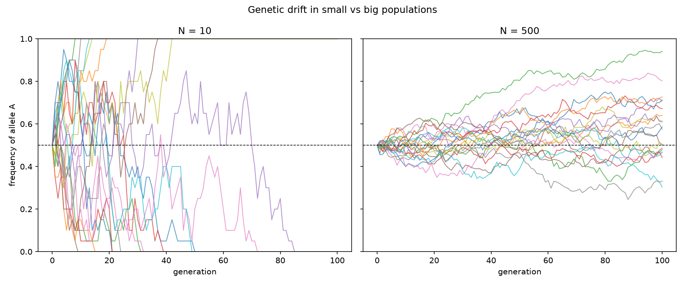

# Genetic drift (Wright-Fisher simulation)

A small simulation of genetic drift : how allele frequencies change from
one generation to the next by random sampling alone, no selection, no
mutation. The goal is to show two classic results of population genetics
directly, from code short enough to read in one sitting.

## Question

Starting from the same allele frequency, how do independent populations
evolve by chance alone, and how does population size change the outcome?

## The model

A diploid population of `N` individuals carries `2N` copies of a gene. To
form the next generation, each of the `2N` new copies is drawn at random and
has probability `p` (the current frequency) of being allele A. Drawing `2N`
copies at probability `p` is a binomial draw, so the whole model is:

```python
copies = rng.binomial(2 * N, freq)   # next generation's count of allele A
freq   = copies / (2 * N)            # back to a frequency
```

Repeating that over generations and across populations is the entire project.

## Results

Populations diverge by chance. Twenty populations all start at `p = 0.5`
with identical parameters, yet drift alone spreads them out, some fix the
allele (frequency 1), some lose it (frequency 0), some keep varying.



Drift is stronger in small populations. With `N = 10`, every population
fixes or loses the allele within 100 generations; with `N = 500`, none do,
they stay near the starting frequency. In a small population each generation
samples few copies, so random deviations are proportionally large; in a large
one they average out. The expected time to fixation scales with `N`.



## Run

```bash
pip install -r requirements.txt
python genetic_drift.py
```

Figures are written to `figures/`. A fixed random seed per population makes
every run reproducible.

## Files

- `genetic_drift.py` : simulation and plotting
- `requirements.txt` : dependencies (numpy, matplotlib)
